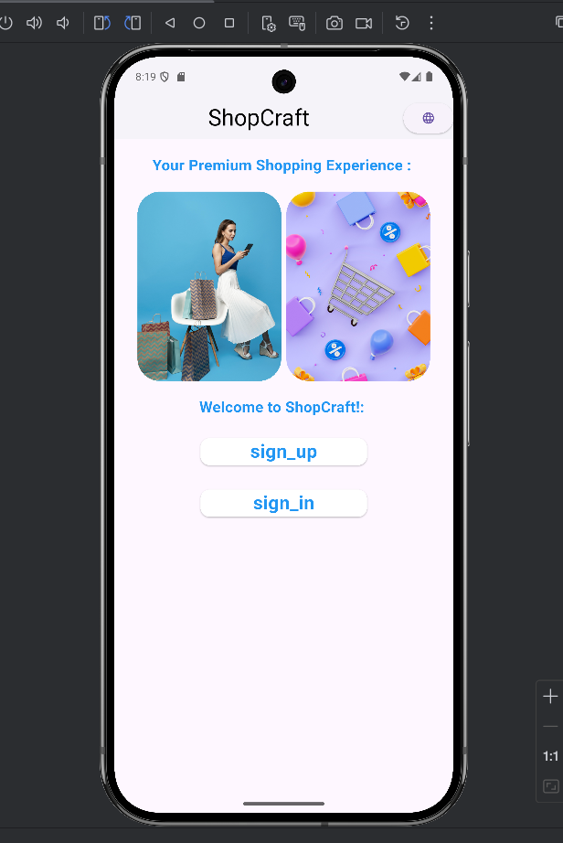
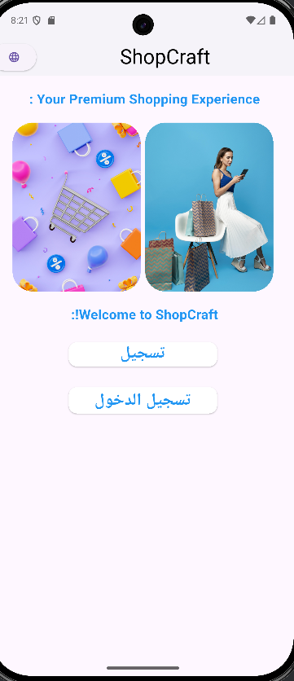
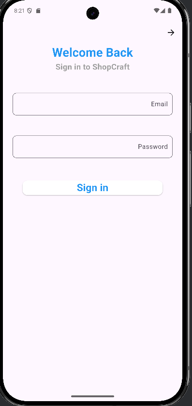
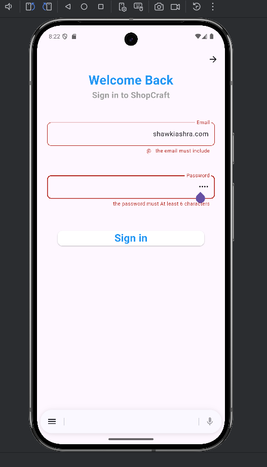
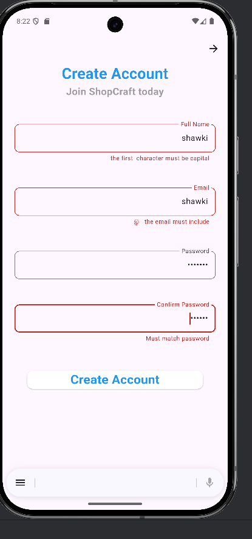
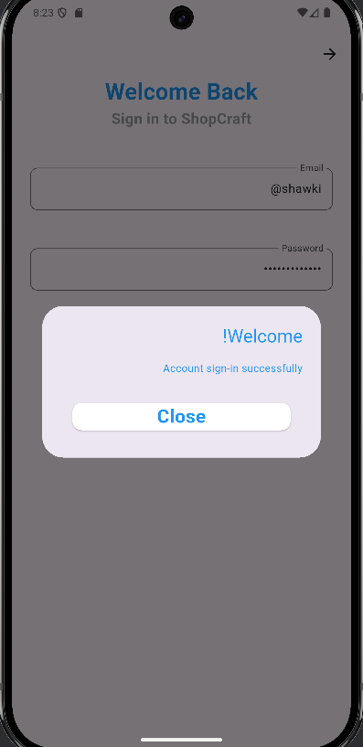
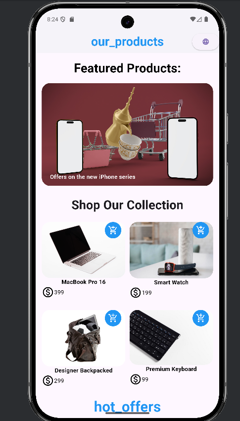
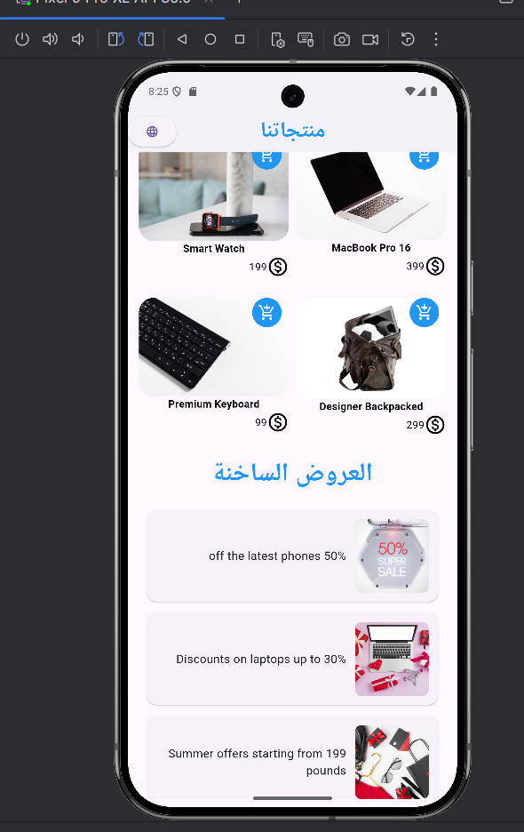

# Shopping App

## Overview
Shopping App is a Flutter-based mobile application designed for a seamless shopping experience. Users can browse and purchase products across multiple categories including electronics, computer accessories, bags, and more. The app features a clean and intuitive interface that makes navigation simple and efficient.

## Features
- Browse products by categories (Electronics, Mice, Bags, etc.)
- Swipeable image carousel for featured products
- Grid layout for easy browsing of multiple items
- Product details page with image, description, and price
- Responsive design for different screen sizes
- Smooth navigation between pages
- Flutter-based, lightweight, and fast

## Setup Instructions

### Prerequisites
- Flutter SDK installed ([Flutter Installation Guide](https://flutter.dev/docs/get-started/install))
- Dart SDK (comes with Flutter)
- IDE like Android Studio, VS Code, or IntelliJ IDEA
- A connected device or emulator

### Installation
1. Clone the repository:
   ```bash
   git clone https://github.com/shawki23-ux/ShoppingApp-.git 


## 📱 Screenshots

### 🏠 Home Screen




### 🛒 Product List




### 🧾 Offers



